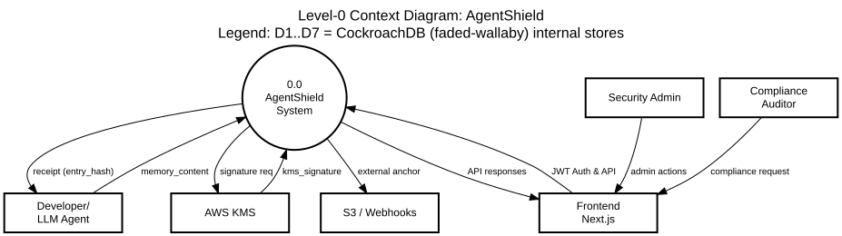
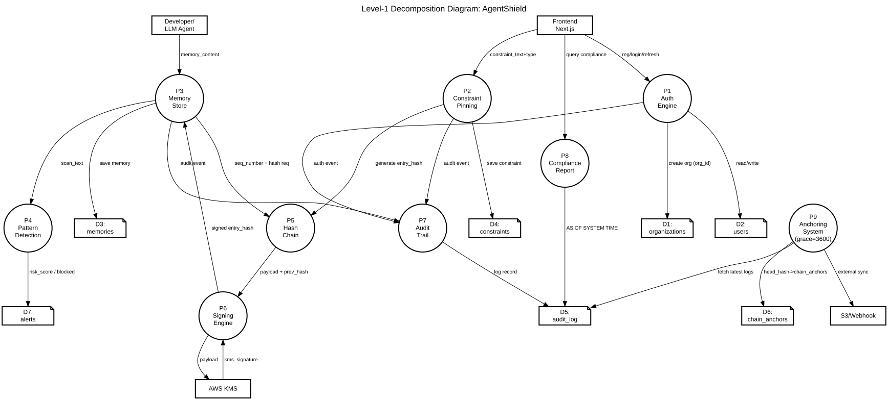

# AgentShield: Tamper-Evident Memory Defense for LLM Agents
**Data Flow Diagram (DFD) & System Architecture Documentation**  
*Prepared for Final Year Minor Project Viva / Presentation*

---

## 1. Introduction & Overview

This document presents the formal Data Flow Diagrams (DFDs) for **AgentShield**, mapping the flow of data between external entities, core processing engines, and internal data stores. The diagrams strictly follow standard academic DFD conventions (Gane and Sarson / Yourdon and Coad hybrid).

- **External Entities (Rectangles):** External actors, agents, or APIs that interact with the system.
- **Processes (Circles):** System components that transform or route data.
- **Data Stores (Open-ended/Notes):** Persistent databases, files, or ledgers.
- **Data Flows (Arrows):** The directional movement of specific data payloads.

---

## 2. Level-0 Context Diagram

The Level-0 diagram shows the entire AgentShield system as a single high-level process (`0.0 AgentShield System`), interacting with all external entities.

### 2.1 External Entities (Level-0)
* **Developer / LLM Agent:** Submits raw memory payloads and receives cryptographically verified hash-chain receipts.
* **Security Admin:** Interacts with the frontend dashboard to manage constraints and configurations.
* **Compliance Auditor:** Views tamper-evident audit logs and generates "AS OF SYSTEM TIME" compliance reports.
* **Frontend Next.js:** The client-side UI application facilitating human interaction.
* **AWS KMS:** The external cryptographic Hardware Security Module (HSM) used for non-repudiable signing.
* **S3 / Webhooks:** External targets for immutable hash-chain anchoring.

---

## 3. Level-1 Decomposition Diagram

The Level-1 diagram breaks down the `0.0 AgentShield System` into its 9 core sub-processes, detailing the internal flow of data and the interaction with 7 distinct database tables.

*(Note: Diagram is structured Top-to-Bottom to accurately trace the lifecycle of a memory payload from ingestion to persistent anchoring).*

### 3.1 Data Dictionary: Processes (P1-P9)
These processes directly map to the core backend architecture found in the `backend/app/` directory:

| Process ID | Name | Source Code Mapping | Description |
|---|---|---|---|
| **P1** | Auth Engine | `routers/auth.py` | Handles JWT issuance, registration, login, and RBAC token generation. |
| **P2** | Constraint Pinning | `core/constraint_pinning.py` | Parses admin constraints, saves them to DB, and pins them to the active context. |
| **P3** | Memory Store | `routers/memories.py` | The main ingestion pipeline. Coordinates scanning, hashing, signing, and storage. |
| **P4** | Pattern Detection | `core/pattern_detection.py` | ASI06 Guard. Scans raw text against 49 malicious regex patterns; returns risk scores. |
| **P5** | Hash Chain | `core/hash_chain.py` | Generates immutable `entry_hash` linking the current payload to the `previous_hash`. |
| **P6** | Signing Engine | `core/signing.py` | Signs the hash context using ECDSA-P256 via AWS KMS to ensure non-repudiation. |
| **P7** | Audit Trail | `core/audit_trail.py` | Records granular, tamper-evident system events and auth failures. |
| **P8** | Compliance Report | `routers/audit.py` | Generates point-in-time compliance state using CockroachDB `AS OF SYSTEM TIME`. |
| **P9** | Anchoring System | `main.py` | Background job securing chain heads to DB, Files, S3, and Webhooks. |

### 3.2 Data Dictionary: Data Stores (D1-D7)
These data stores map directly to the SQLAlchemy models representing the CockroachDB distributed database:

| Store ID | Name | Source Code Mapping | Stored Data Attributes |
|---|---|---|---|
| **D1** | organizations | `models/organization.py` | `org_id`, `org_name`, `plan`, `created_at` |
| **D2** | users | `models/user.py` | `user_id`, `org_id`, `email`, `password_hash`, `full_name`, `role`, `is_active` |
| **D3** | memories | `models/memory.py` | `memory_id`, `org_id`, `content`, `memory_type`, `importance_score`, `trust_level`, `source_provenance`, `previous_hash`, `entry_hash`, `kms_signature`, `sequence_number` |
| **D4** | constraints | `models/constraint.py` | `constraint_id`, `org_id`, `constraint_text`, `constraint_type`, `is_active`, `previous_hash`, `entry_hash`, `kms_signature` |
| **D5** | audit_log | `models/audit_log.py` | `audit_id`, `org_id`, `event_type`, `actor`, `target`, `action`, `details`, `previous_hash`, `entry_hash`, `sequence_number`, `recorded_at` |
| **D6** | chain_anchors | `models/chain_anchor.py` | `anchor_id`, `org_id`, `chain_type`, `chain_head_hash`, `chain_length`, `anchor_target`, `external_ref`, `created_at` |
| **D7** | alerts | `models/alert.py` | `alert_id`, `org_id`, `alert_type`, `severity`, `description`, `patterns_matched`, `is_resolved` |

### 3.3 Data Flows
* `reg/login/refresh`: Authentication payload and session tokens.
* `create org (org_id)`: Registration data to provision a new tenant.
* `read/write`: Auth engine querying user credentials.
* `constraint_text+type`: New rule submission from admin.
* `save constraint`: Database persistence of a new governance rule.
* `generate entry_hash`: Request to append the constraint to the hash chain.
* `memory_content`: The raw text payload submitted by the LLM agent.
* `scan_text`: Payload forwarded to the Pattern Detection Engine.
* `risk_score / blocked`: Evaluation result dictating if the memory is safe.
* `seq_number + hash req`: Request to append the memory to the hash chain.
* `payload + prev_hash`: Data sent to the Hash Engine to compute the cryptographic link.
* `signed entry_hash`: The hash returned and cryptographically signed.
* `save memory`: Database persistence of the memory.
* `auth event` / `audit event`: Security and system lifecycle events sent to the Audit Trail.
* `log record`: Immutable write of an event to the audit ledger.
* `payload` / `kms_signature`: Communication with AWS KMS to digitally sign the entry.
* `query compliance` / `AS OF SYSTEM TIME`: Point-in-time state reconstruction delivered to the auditor.
* `fetch latest logs` / `head_hash->chain_anchors`: The background anchoring job reading the latest chain head.
* `external sync`: The final broadcast of the anchored chain head to S3/Webhooks.
