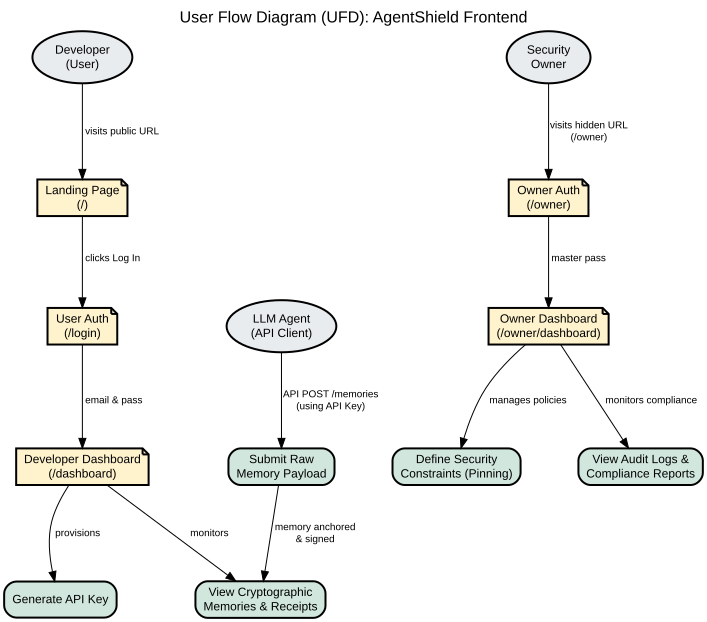

# AgentShield - User Flow Documentation

This document outlines the **User Flow Diagram (UFD)** for the AgentShield frontend interface. It maps the journey of all primary actors (Developers, Admins, and LLM Agents) through the web application.

## 1. User Flow Diagram (UFD)

The diagram below visualizes the navigation paths and primary actions available to each user role after interacting with the Landing Page and Authentication endpoints.

## 2. Actor Journeys

### 2.1 Developer (User Role)
* **Entry:** Visits the public Landing Page (`/`).
* **Authentication:** Navigates to `/login`, enters email/password. The backend verifies credentials against `users` table and issues a JWT with `role='user'`.
* **Routing:** Automatically redirected to the **Developer Dashboard** (`/dashboard`).
* **Primary Actions:**
  * **Generate API Key:** Provisions a new cryptographic key to authenticate their LLM Agents.
  * **View Memories:** Monitors the real-time stream of memories submitted by their agents, viewing the cryptographic receipts (Entry Hashes and KMS Signatures) confirming immutability.

### 2.2 Security Owner (Admin Role)
* **Entry:** Visits the public Landing Page (`/`).
* **Authentication:** Navigates to the hidden bastion route `/owner` and submits the Master Password. The backend verifies against the bcrypt-hashed env variable and issues a session JWT.
* **Routing:** Automatically redirected to the **Owner Dashboard** (`/owner/dashboard`).
* **Primary Actions:**
  * **Define Security Constraints:** Uses the Pinning Engine UI to establish hard governance rules (e.g., "Never leak AWS keys") that LLM Agents cannot bypass.
  * **View Audit Logs & Reports:** Monitors system-wide compliance, viewing real-time SSE streams and live hash-chain verification.

### 2.3 LLM Agent (API Client)
* **Entry:** Does not interact with the GUI.
* **Authentication:** Uses the API Key generated by the Developer.
* **Primary Action:** Submits raw memory payloads via `POST /api/memories`.
* **Outcome:** The memory is routed through the Pattern Detection, Hash Chain, and KMS Signing engines before appearing as a verified, immutable record on the Developer's Dashboard.
